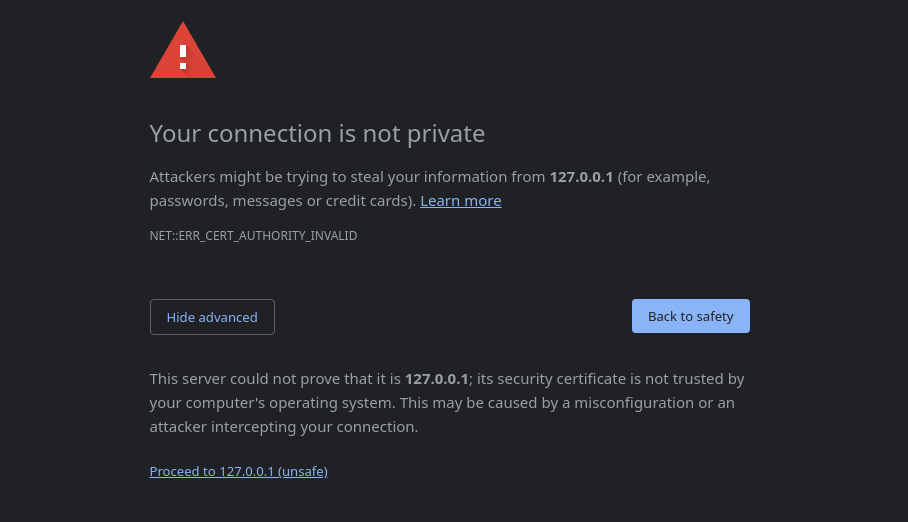

# Write-up

#### Link to the repository

[https://github.com/mejitos/cyber-security-base-2023-project-i](https://github.com/mejitos/cyber-security-base-2023-project-i)

#### Installation

Installation instructions along with other relevant information can be found
from the repository's `README.md` file.


## Flaw 1: [A01:2021 - Broken Access Control](https://owasp.org/Top10/A01_2021-Broken_Access_Control/)

#### Location(s)

<!-- #L241-L243-->
https://github.com/mejitos/cyber-security-base-2023-project-i/blob/398bee06a4f868e34acf4b618db9c4bc02cc4096/run.py#L241-L243

<!-- #L266-L275-->
https://github.com/mejitos/cyber-security-base-2023-project-i/blob/398bee06a4f868e34acf4b618db9c4bc02cc4096/run.py#L266-L275

#### Description

The application has classical problem where the application was initially
devloped as single-user system, but when it was time to change to multi-user
system, not enough things were taken into consideration. When using the GUI
from browser, everything seems normal. User's aren't able to see or modify
anything that doesn't belong to them. However, if malicious user decides to
use any other client to make requests, it is possible to share unshared images
or delete any existing images by only knowing the ID of the image. This ID
can be obtained by using browser development tools.

Example `curl` command for deleting an image (change the image ID and session
cookie accordingly):

```bash
curl -X DELETE \
    "localhost:5000/api/images/d63291b2-d1de-4bed-b9e3-566229b6d181" \
    --cookie "session=eyJ1c2VyIjp7ImlkIjoiY2YyZGQwODUtNjEyYS00MDg2LWJmMGMtZTgxMzIwMDRhZTA4IiwibmFtZSI6ImFsaWNlIn19.ZPr1LQ.QvB5s2c7S3SduLcBTrlupHSHGao"
```

#### Fix

Ownership of the image should be checked when sharing or deleting an image.
Just like it is done while requesting the list of the images. The implementation
has to make sure, it doesn't matter what client send the request, no one
except the owner of the image should be able to modify the images.

<!-- #L234-L239 -->
https://github.com/mejitos/cyber-security-base-2023-project-i/blob/398bee06a4f868e34acf4b618db9c4bc02cc4096/run.py#L234-L239

<!-- #L259-L264 -->
https://github.com/mejitos/cyber-security-base-2023-project-i/blob/398bee06a4f868e34acf4b618db9c4bc02cc4096/run.py#L259-L264


## Flaw 2: [A02:2021 - Cryptographic Failures](https://owasp.org/Top10/A02_2021-Cryptographic_Failures/)

#### Location(s)

<!-- #L317 -->
https://github.com/mejitos/cyber-security-base-2023-project-i/blob/398bee06a4f868e34acf4b618db9c4bc02cc4096/run.py#L317

#### Description

The application doesn't use secure connection between the client and
server. This allows malicious actor to capture the traffic with network
packet sniffer like Wireshark, and see the packet contents.
As an example, captured packets containing the username and password of
the user during login:


#### Fix

> NOTE: This is not something that Flask framework itself recommends
> doing. Instead you need knowledge about the underlying libraries.
> Like Flask itself notes, Flask should not be used as a production
> server, so these kind of things are not visible to users themselves.
> Therefore this solution is for education purposes only.
> If you don't know what you are doing, just follow the documentation.

Although this is not an actual production application, we can obtain
secure connection. It is highly recommended to also develop with secure
connection and there are multitude of tools for that.
With Flask, we can obtain this easily by either creating self-signed
certificates or using Werkzeug's ad-hoc-solution. To keep things simple,
we opt to use the Werkzeug's ad-hoc-solution.

You need to have `pyopenssl` installed (installed with the requirements)
and add the `ssl_context` keyword argument to the application `run()`
method:

<!-- #L307-L315 -->
https://github.com/mejitos/cyber-security-base-2023-project-i/blob/398bee06a4f868e34acf4b618db9c4bc02cc4096/run.py#L307-L315

Since the browser or operating system doesn't recognize this ad-hoc
certificate authority, you might see security notification in the browser,
and manually allow the use of the unknown certificate through the
advanced-options:



Now the packet contents are encrypted.


## Flaw 3: [A03:2021 - Injection](https://owasp.org/Top10/A03_2021-Injection/)

#### Location(s)

<!-- #L192-L195 -->
https://github.com/mejitos/cyber-security-base-2023-project-i/blob/398bee06a4f868e34acf4b618db9c4bc02cc4096/run.py#L192-L195

#### Description

The application uses Linux's `file` command to check the type of the
uploaded file. However the command uses the filename as the part of the
command. This allows malicious user to pass shell commands either by
uploading specifically named files to the server using the web
application or by using some other client like `curl` to pass arbitrary
filenames, and therefore arbitrary shell commands.

Example commands (NOTE: Linux solution) for exploitation:

```bash
# Create file called legit.txt which is sent to the server
touch legit.txt

# Send the file to the server with command injection as part
# of the filename. This creates file called 'pwn.txt' with
# contents "howdy doody from hacker".
#
# NOTE: Change the session cookie to your own cookie (can be
# taken from browser using devtools).
curl -X POST \
    localhost:5000/api/images \
    -F "image=@legit.txt;filename=legit.txt && echo 'howdy doody from hacker' >> pwn.txt" \
    --cookie "session=eyJ1c2VyIjp7ImlkIjoiY2YyZGQwODUtNjEyYS00MDg2LWJmMGMtZTgxMzIwMDRhZTA4IiwibmFtZSI6ImFsaWNlIn19.ZPr1LQ.QvB5s2c7S3SduLcBTrlupHSHGao"

# Remove the file created with the command injection
curl -X POST \
    localhost:5000/api/images \
    -F "image=@legit.txt;filename=legit.txt && rm pwn.txt" \
    --cookie "session=eyJ1c2VyIjp7ImlkIjoiY2YyZGQwODUtNjEyYS00MDg2LWJmMGMtZTgxMzIwMDRhZTA4IiwibmFtZSI6ImFsaWNlIn19.ZPr1LQ.QvB5s2c7S3SduLcBTrlupHSHGao"
```

#### Fix

The problem can be fixed by setting the keyword argument `shell=False`,
and passing the shell command as an array of strings instead of
concatenated string. This works because the command shell is not launched
anymore, and the given arguments are passed to the argument vector of the
`file` program, preventing any other programs or commands to be executed.

<!-- #L182-L189 -->
https://github.com/mejitos/cyber-security-base-2023-project-i/blob/398bee06a4f868e34acf4b618db9c4bc02cc4096/run.py#L182-L189


## Flaw 4: [A05:2021 - Security Misconfiguration](https://owasp.org/Top10/A05_2021-Security_Misconfiguration/)

#### Location(s)

<!-- #L39-L40 -->
https://github.com/mejitos/cyber-security-base-2023-project-i/blob/398bee06a4f868e34acf4b618db9c4bc02cc4096/run.py#L39-L40

#### Description

Flask applications have debug-mode which allows developers to see extra
information about errors happening during development. The errors are
shown as web pages generated at runtime. These errors show a lot of extra
information about the application in the form of stack traces. This
information could be used to find vulnerabilities and/or intelligence
gathering to exploit the application and/or it's users.

Flask applications also use secret key as part of the session cookie.
This key is used to verify the signature of the session cookie. Having
this key exposed would allow the attacker to forge the session cookie
signature and imitate valid users.

#### Fix

The configuration could be passed via environment variables so they are
defined outside of the application. More importantly, they are defined
outside of the source code. Instead they are explicitly passed with the
arguments when the application is launched.

Secret key should be a random string with sufficient length. Debug-mode
should always default to False unless explicitly told otherwise during
development process e.g. when running development server.

Example command (NOTE: Linux solution) to run the application with explicit
debug mode and randomly generated secret key:

```bash
DEBUG=1 SECRET_KEY="$(cat /dev/urandom | tr -dc '[:alpha:]' | fold -w ${1:-64} | head -n 1)" python run.py
```

<!-- #L32-37 -->
https://github.com/mejitos/cyber-security-base-2023-project-i/blob/398bee06a4f868e34acf4b618db9c4bc02cc4096/run.py#L32-L37


## Flaw 5: [A07:2021 - Identification and Authentication Failures](https://owasp.org/Top10/A07_2021-Identification_and_Authentication_Failures/)

#### Location(s)

<!-- -->
The whole `login()` function starting at line 84.

#### Description

The application allows unlimited attempts for guessing correct username
and password. This enables brute force attacks to be carried out. Attackers
could eventually guess the credentials of all system users. This can be
done with automated scripts and even in a distributed manner with multiple
machines.

<!--
```bash
curl -X POST localhost:5000/login -F "username=a" -F "password=b"
```
-->

#### Fix

To keep things simple, the problem is fixed with a simple jail solution.
First set required variables to keep track of login attempts and unwanted
IP addresses:

<!-- #L43-L52 -->
https://github.com/mejitos/cyber-security-base-2023-project-i/blob/398bee06a4f868e34acf4b618db9c4bc02cc4096/run.py#L43-L52

Then block login attempts from all unwanted IP addresses (= from addresses
in the jail):

<!-- #L86-L91 -->
https://github.com/mejitos/cyber-security-base-2023-project-i/blob/398bee06a4f868e34acf4b618db9c4bc02cc4096/run.py#L86-L91

Then after each unsuccesful login attempt, make note of this and put IP
addresses into jail if they have tried to log in too many times:

<!-- #L111-L119 -->
https://github.com/mejitos/cyber-security-base-2023-project-i/blob/398bee06a4f868e34acf4b618db9c4bc02cc4096/run.py#L111-L119

On each succesful login, the login attempts will be reseted:

<!-- #L104-L108 -->
https://github.com/mejitos/cyber-security-base-2023-project-i/blob/398bee06a4f868e34acf4b618db9c4bc02cc4096/run.py#L104-L108

This fixes the problem but is not great for user experience, because
users will be blocked from using the application until the application
is restarted (= which will clear to jail completely). Actual production
grade solution would be a lot more complex and there are existing solutions
for this problem outside the application (e.g. fail2ban).


## Flaw 6: [A09:2021 - Security Logging and Monitoring Failures](https://owasp.org/Top10/A09_2021-Security_Logging_and_Monitoring_Failures/)

#### Location(s)

Half a dozen locations, which are easier to provide in the `Fix` section
with explanation.

#### Description

Currently the application doesn't do any logging whatsoever. This is
especially problematic when security incidents are not being logged. This
increases reaction time and prevents early mitigation of possible system
breaches. This allows attackers to roam pretty much freely in the system
and gather information about the system.

#### Fix

First we need to configure a simple logger to log into file `visp.log`:

<!-- #L18-27 -->
https://github.com/mejitos/cyber-security-base-2023-project-i/blob/398bee06a4f868e34acf4b618db9c4bc02cc4096/run.py#L18-L27

Then we need to apply logging each time a security event happens.

When someone tries to access a resource without authorization:

<!-- #L59-L63 -->
https://github.com/mejitos/cyber-security-base-2023-project-i/blob/398bee06a4f868e34acf4b618db9c4bc02cc4096/run.py#L59-L63

When someone has tried to login unsuccesfully:

<!-- #L121-L128 -->
https://github.com/mejitos/cyber-security-base-2023-project-i/blob/398bee06a4f868e34acf4b618db9c4bc02cc4096/run.py#L121-L128

When someone tried to execute path injection:

<!-- #L171-L175 -->
https://github.com/mejitos/cyber-security-base-2023-project-i/blob/398bee06a4f868e34acf4b618db9c4bc02cc4096/run.py#L171-L175

When someone tried to upload non-supported file:

<!-- #L199-203 -->
https://github.com/mejitos/cyber-security-base-2023-project-i/blob/398bee06a4f868e34acf4b618db9c4bc02cc4096/run.py#L199-L203

When someone tries to share an image that doesn't exist (this should never
happen if the application is used as intended, so this is suspicious):

<!-- #L245-L249  -->
https://github.com/mejitos/cyber-security-base-2023-project-i/blob/398bee06a4f868e34acf4b618db9c4bc02cc4096/run.py#L245-L249

When someone tries to delete an image that doesn't exist (this should never
happen if the application is used as intended, so this is suspicious):

<!-- #L277-L281 -->
https://github.com/mejitos/cyber-security-base-2023-project-i/blob/398bee06a4f868e34acf4b618db9c4bc02cc4096/run.py#L277-L281

This file can then be analyzed during runtime with separate tools like
SIEM and intrusion detection (IDS) systems for system adminstrators and
CSO's to monitor and initiate necessary actions.

It is also possible to handle the brute force problem (Flaw 5) with these
tools instead of the given naive implementation (although it fixes the problem,
it is a bad user experience). Also in general, all of these flaws like Flaw 1
(Broken access control) should be logged if detected.
