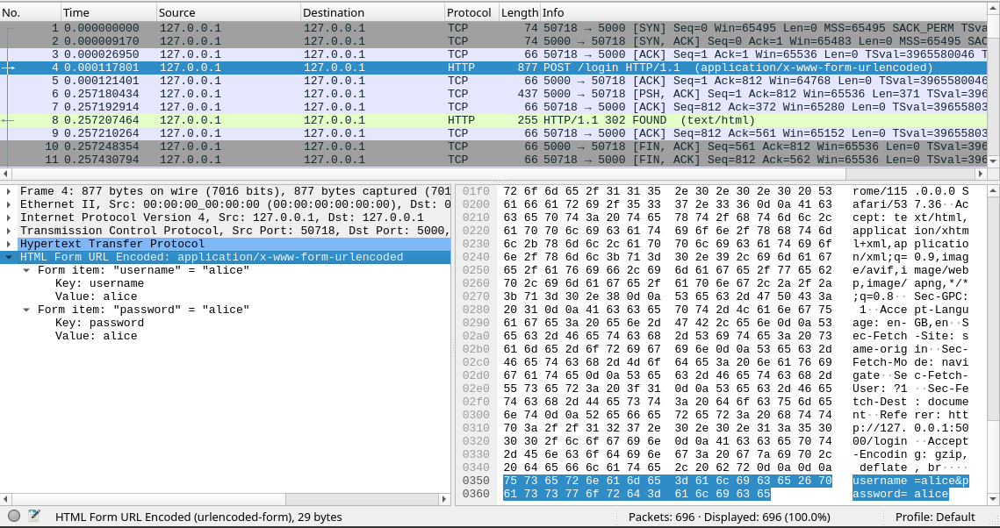

# Write-up

#### Link to the repository

<!--
[link-to-repo]()
-->

#### Installation

Installation instructions along with other relevant information can be found
from the repository's file `README.md`.


## Flaw 1: [A01:2021 - Broken Access Control](https://owasp.org/Top10/A01_2021-Broken_Access_Control/)

#### Location(s)

<!--
[github-link-to-the-location]()
-->

#### Description

<!-- WHERE -->
- VISP has exactly this kind of problem.
- When fetching all images, the ownership of the images is checked so
each user will only see their own images.
- This allows user's to modify only their own images and not others.
- However, this restriction only applies if the application is used
through the web application.
- This does nothing to requests made by other clients.

<!-- HOW TO EXPLOIT -->
- This can be exploited

#### Fix

- Broken access control can be fixed
- by making sure the requested resources belong to the user requesting them.
- It has to be implemented in such way, that it doesn't matter who or what
sends the request.
- Similar checks should be made when updating and removing images as are
done when the images are being checked

- link?
- link?


## Flaw 2: [A02:2021 - Cryptographic Failures](https://owasp.org/Top10/A02_2021-Cryptographic_Failures/)

#### Location(s)

https://github.com/mejitos/cyber-security-base-2023-project-i/blob/90db75b08af93b9c28d48b363554ec6110bfb08d/run.py#L324

#### Description

The application doesn't use secure connection between the client and
server. This allows malicious actor to capture the traffic with network
packet sniffer like Wireshark, and see the packet contents.
As an example, captured packets containing the username and password of
the user during login:



#### Fix

> NOTE: This is not something that Flask framework itself recommends
> doing. Instead you need knowledge about the underlying libraries.
> Like Flask itself notes, Flask should not be used as a production
> server, so these kind of things are not visible to users themselves.
> Therefore this solution is for education purposes only.
> If you don't know what you are doing, just follow the documentation.

Although this is not an actual production application, we can obtain
secure connection. It is highly recommended to also develop with secure
connection and there are multitude of tools for that.
With Flask, we can obtain this easily by either creating self-signed
certificates or using Werkzeug's ad-hoc-solution. To keep things simple,
we opt to use the Werkzeug's ad-hoc-solution.

You need to have `pyopenssl` installed (installed with the requirements)
and add the `ssl_context` keyword argument to the application `run()`
method.

<!--
Link to fix
-->

Since the browser or operating system doesn't recognize this ad-hoc
certificate authority, you might see security notification in the browser,
and manually allow the use of the unknown certificate:


Now the packets cannot be sniffed.


## Flaw 3: [A03:2021 - Injection](https://owasp.org/Top10/A03_2021-Injection/)

#### Location(s)

<!--
[github-link-to-the-location](github-link-to-location)
-->

#### Description

The application uses Linux's `file` command to check the type of the
uploaded file. However the command uses the filename as the part of the
command. This allows user to pass Shell commands either by uploading
specifically named files to the server using the web application or
by using some other client like CURL to pass arbitrary filenames.

Little example commands (NOTE: Linux solution) for exploitation:

```bash
# Create file called legit.txt which is sent to the server
touch legit.txt

# Send the file to the server with command injection as part
# of the filename. This creates file called 'pwn.txt' with
# contents "howdy doody from hacker".
#
# NOTE: Change the session cookie to your own cookie (can be
# taken from browser using devtools).
curl -X POST localhost:5000/api/images \
    -F "image=@legit.txt;filename=legit.txt && echo 'howdy doody from hacker' >> pwn.txt" \
    --cookie "session=eyJ1c2VyIjp7ImlkIjoiY2YyZGQwODUtNjEyYS00MDg2LWJmMGMtZTgxMzIwMDRhZTA4IiwibmFtZSI6ImFsaWNlIn19.ZPr1LQ.QvB5s2c7S3SduLcBTrlupHSHGao"

# Remove the file created with the command injection
curl -X POST localhost:5000/api/images \
    -F "image=@legit.txt;filename=legit.txt && rm pwn.txt" \
    --cookie "session=eyJ1c2VyIjp7ImlkIjoiY2YyZGQwODUtNjEyYS00MDg2LWJmMGMtZTgxMzIwMDRhZTA4IiwibmFtZSI6ImFsaWNlIn19.ZPr1LQ.QvB5s2c7S3SduLcBTrlupHSHGao"
```

This injection could be used to run pretty much arbitrary commands
in the command shell.

#### Fix

The problem can be fixed by setting the keyword argument `shell=False`,
and passing the shell command as an array of strings instead of
concatenated string. This works because the command shell is not launched
anymore, and the given arguments are passed to the argument vector of the
`file` program, preventing any other programs or commands to be executed.

<!--
github link to source
-->


## Flaw 4: [A05:2021 - Security Misconfiguration](https://owasp.org/Top10/A05_2021-Security_Misconfiguration/)

#### Location(s)

<!--
[github-link-to-the-location](github-link-to-location)
-->

#### Description

Flask applications have debug-mode which allows developers to see extra
information about errors happening during development. The errors are
shown as web pages generated at runtime. These errors show a lot of extra
information about the application in the form of stack traces. This
information could be used to find vulnerabilities and/or intelligence
gathering to exploit the application and/or it's users.

Flask applications also use secret key as part of the session cookie.
This key is used to verify the signature of the session cookie. Having
this key would allow the attacker to forge the session cookie signature
and imitate valid users.

#### Fix

The configuration could be passed via environment variables so they are
defined outside of the application. More importantly, they are defined
outside of the source code. Instead they are explicitly passed with the
arguments when the application is launched.

Secret key should be a random string with sufficient length. Debug-mode
should always default to False unless explicitly told otherwise.

Example command (NOTE: Linux solution) to run the application with debug
mode and randomly generated secret key:

```bash
DEBUG=1 SECRET_KEY="$(cat /dev/urandom | tr -dc '[:alpha:]' | fold -w ${1:-64} | head -n 1)" python run.py
```

Required changes in the source code can be found at:

[github-link-to-the-location]()


## Flaw 5: [A07:2021 - Identification and Authentication Failures](https://owasp.org/Top10/A07_2021-Identification_and_Authentication_Failures/)

#### Location(s)

<!--
[github-link-to-the-location](github-link-to-location)
-->

#### Description

asd

```bash
curl -X POST localhost:5000/login -F "username=a" -F "password=b"
```

#### Fix

asd


## Flaw 6: [A09:2021 - Security Logging and Monitoring Failures](https://owasp.org/Top10/A09_2021-Security_Logging_and_Monitoring_Failures/)

#### Location(s)

<!--
[github-link-to-the-location](github-link-to-location)
-->

#### Description

Currently the application doesn't do any logging whatsoever.

This prevents

security incidents

and increases reaction time

#### Fix

First we need to configure a simple logger to log into file `visp.log`:

[github-link-to-location]()

Then we need to apply logging each time a security event happens.

This file can then be analyzed during runtime with separate tools like
SIEM and intrusion detection (IDS) systems for system adminstrators and
CSO's to monitor. It is also possible to handle the brute force problem
(Flaw 5) with these tools instead of our naive implementation (although
it fixes the problem, it is bad user experience).


